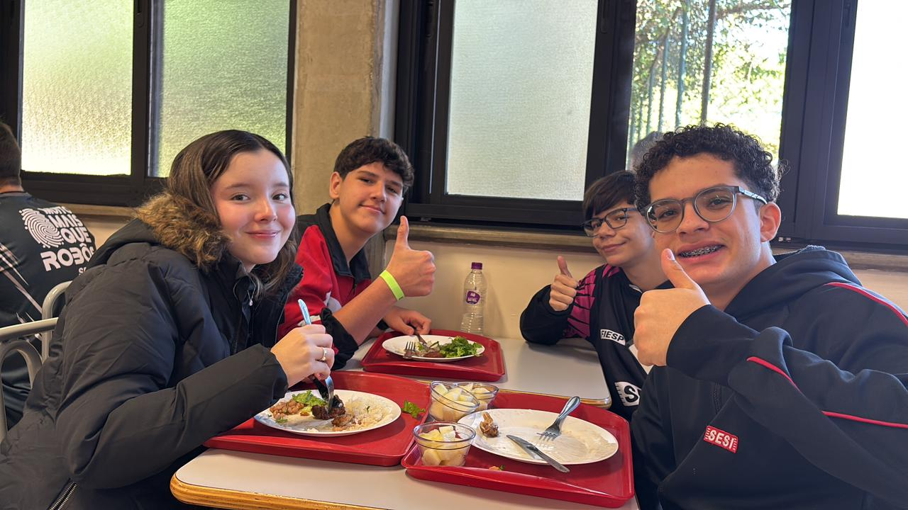
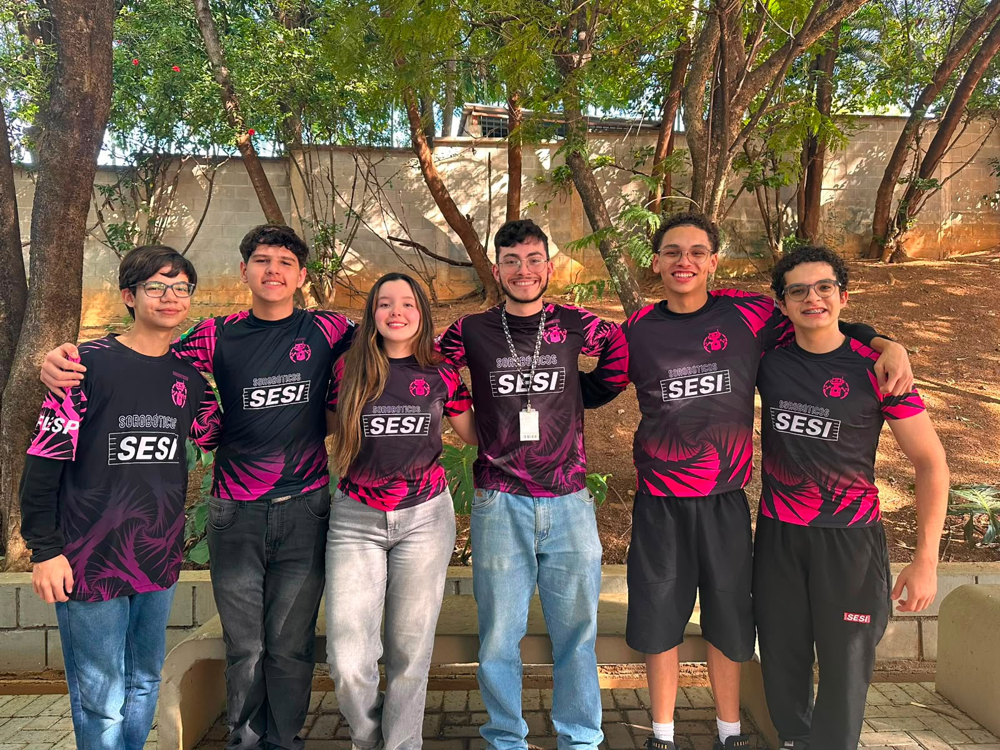
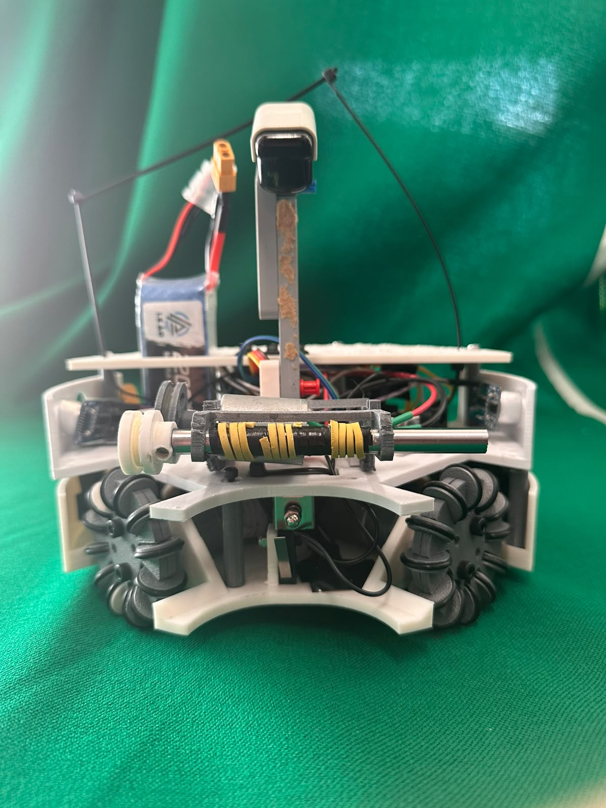

# 🤖 Sorobóticos

  

  <strong>Equipe de Robótica Competitiva • RoboCupJunior Soccer</strong>

---

# 👥 Sobre Nós

A **Sorobóticos Soccer** é uma equipe de robótica competitiva formada por estudantes apaixonados por tecnologia, engenharia e inovação. Nosso objetivo é desenvolver robôs autônomos capazes de atuar em partidas da modalidade **RoboCupJunior Soccer**, aplicando conhecimentos de programação, eletrônica, mecânica e manufatura digital.

A equipe acredita na aprendizagem prática como ferramenta de transformação, utilizando cada competição como uma oportunidade para evoluir tecnicamente, trabalhar em equipe e desenvolver soluções cada vez mais eficientes.

Atualmente nossos projetos são desenvolvidos com foco em:

* 🤖 Robótica Autônoma
* ⚙️ Engenharia Mecânica
* 🔌 Sistemas Embarcados
* 🧠 Algoritmos de Navegação
* 🎯 Visão Estratégica para Competições
* 🏆 RoboCupJunior Soccer

---

# 🏆 RoboCupJunior Soccer

Nosso robô foi desenvolvido para competir na categoria **Soccer Lightweight**, onde dois robôs autônomos atuam em uma partida de futebol utilizando sensores para localizar a bola, navegar pelo campo e executar estratégias ofensivas e defensivas.

---

# 📸 Nossa Equipe

  

---

# 🤖 Nosso Robô

  

---

# 🚀 Principais Características

### Movimentação Omnidirecional

O sistema utiliza quatro motores DC de 12V e rodas omni, permitindo movimentação em qualquer direção sem necessidade de girar o robô antes do deslocamento.

### Sistema de Dribbler

O dribbler foi desenvolvido para melhorar a captura e retenção da bola durante o jogo. O mecanismo utiliza transmissão por correias e polias para aumentar a velocidade de rotação e maximizar o controle da bola.

### Sistema de Kicker

O chute é realizado através de um mecanismo baseado em solenoide, projetado para alinhar o ponto de impacto ao centro da bola e aumentar a eficiência das finalizações.

### Posicionamento no Campo

O robô utiliza sensores ultrassônicos para estimar sua posição relativa dentro da arena e manter sua estratégia de navegação.

### Controle de Orientação

A orientação é monitorada continuamente por uma IMU, permitindo correções automáticas durante a movimentação e maior precisão nos deslocamentos.

---

# 🛠️ Hardware Utilizado

| Componente                     | Função                      |
| ------------------------------ | --------------------------- |
| Arduino Mega 2560 R3           | Controle principal          |
| Sensores IR TSOP4838           | Detecção da bola            |
| Sensores Ultrassônicos HC-SR04 | Posicionamento              |
| IMU BNO055                     | Orientação                  |
| Drivers L298N                  | Controle dos motores        |
| Motores DC 12V 500 RPM         | Tração                      |
| Motor DC 12V 200 RPM           | Dribbler                    |
| Solenoide                      | Kicker                      |
| Rodas Omni                     | Movimentação omnidirecional |

---

# 🏗️ Estrutura Mecânica

O chassi foi modelado em **Fusion 360** e fabricado através de impressão 3D.

### Materiais Utilizados

* TPU (Poliuretano Termoplástico)
* ABS (Acrilonitrila Butadieno Estireno)

O projeto foi otimizado para:

* Baixo centro de gravidade;
* Alta resistência a impactos;
* Facilidade de manutenção;
* Substituição rápida de componentes.

---

# 💡 Diferenciais do Projeto

### 🔧 Design Modular

O sistema foi projetado para permitir trocas rápidas de módulos críticos, reduzindo o tempo de manutenção entre partidas.

### 📡 Suporte Ajustável para Sensores IR

O suporte do sensor infravermelho permite ajustes mecânicos para adaptação a diferentes condições de campo.

### 🛡️ Chassi em TPU

A utilização de TPU proporciona absorção de impactos superior, aumentando a durabilidade da estrutura durante competições.

---

# 📈 Tecnologias Utilizadas

* Arduino IDE
* C++
* Fusion 360
* Impressão 3D
* BNO055
* HC-SR04
* TSOP4838

---

# 📧 Contato

**Sorobóticos Soccer**

📩 [soroboticossoccer@gmail.com](mailto:soroboticossoccer@gmail.com)
📬 Instagram: [@_soroboticos](https://www.instagram.com/_soroboticos/)

---

Desenvolvido com dedicação pela equipe Sorobóticos⚽🤖

